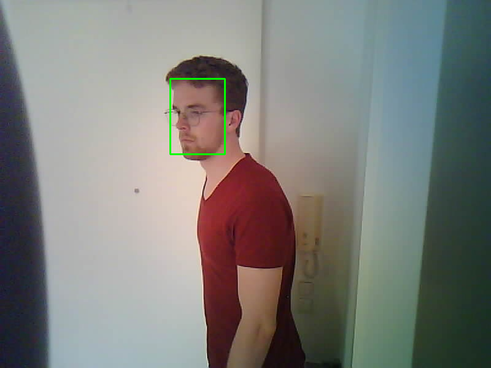

# ESP32-CAM Smart Entry System: Face Detection & Recognition

This repository contains the setup, architecture, and current status of an ESP32-CAM-based door entry monitoring system with automated facial detection and recognition, currently running on my [Zorin server](https://github.com/JannisFinnSchmidt/Home-Server-Cluster).

---

## System Architecture

- **Capture Device:** ESP32-CAM board mounted at the apartment entry, communicating over local Wi-Fi.
- **Server:** Zorin OS Server (currently CPU-based processing).
- **Face Detection & Localization:** YuNet model for localizing facial regions using bounding boxes (BBox).
- **Face Recognition Pipeline:** Cosine similarity evaluation on feature vectors/embeddings extracted from face crops.

---

## Setup & Current Workflow

### 1) Image Capture via Wi-Fi:

A custom client built via Arduino IDE allows to trigger image capture remotely over Wi-Fi whenever requested.

### 2) Face Detection & Bounding Box (YuNet):

The Captured frames are currently processed using YuNet. While facial landmark estimation is unreliable, YuNet's bounding box prediction performs consistently well for cropping facial regions.
Due to the unreliable nature of landmark predictions, the images are currently not rotated.

### 3) Similarity Evaluation:

The Camera setup should allow to recognize multiple known people and detect when people are unknown. Therefore, using a sigmoid based classification is not suitable for the task.
The idea is to extract feature vectors from the final layer of the face recognition model (currently EfficientNet is implemented) and calculate a mean vector with standard deviation for each person.
Using Cosine similarity of new images to these mean vectors and setting thresholds for recognizing a person allows for detecting unknown individuals.
However, EfficientNet proved to be unfit for the task, seemingly encoding lighting and other image properties rather than the actual faces.

---

## Challenges & Limitations

- **Unreliable Landmark Estimation:**
  - Rotation/alignment techniques based on YuNet's facial landmarks didn't work, as the landmark predictions don't reliably identify eyes, mouth and nose
- **Background & Environmental Noise:**
  - EffiecientNet seems to rather encode noise, lighting and background fragments rather than the actual face
- **Camera Sensor Limitations:**
  - High noise levels and poor resolution from the stock ESP32-CAM degrade input feature quality.

---

## Roadmap & Next Steps

### 1) GPU Acceleration:

- Offload feature extraction and vector comparisons to dedicated GPU resources to enable larger model backbones.

### 2) Dedicated Metric Learning Architecture:

- Implement specialized face recognition models (e.g., ArcFace, InsightFace, or MobileFaceNet) optimized for open-set verification and cosine distance thresholding.

### 3) Hardware Upgrade:

- Replace the stock ESP32-CAM sensor with higher-quality optics to improve image quality.
